.. _ex-full-hypercausal-pennylane-demo:

====================================================
Full Hypercausal System Demo (PennyLane + SPSA + KL)
====================================================
.. |Δα| unicode:: U+0394 U+03B1
   :trim:
   
Overview
========
This example demonstrates a **full hypercausal system** on a PennyLane backend,
combining causal feedback with **SPSA derivative-free optimization** and a
**KL-constrained trust-region guard**.
Dynamic depth scheduling and multi-metric telemetry track how the internal
feedback parameter :math:`\alpha` co-evolves with coherence and consistency
under non-stationary drift.

The model evaluates the stability of quantum-inspired feedback systems under
drift, using adaptive control of internal causal parameters to maintain
temporal coherence and counterfactual consistency.

Core Objectives
===============
- **Hypercausal Feedback Modeling:** multi-directional causal propagation.
- **Quantum-Inspired Efficiency:** simulated superposition for reduced cost.
- **Deterministic–Stochastic Integration:** deterministic and probabilistic backends.
- **Causal Stability Measurement:** tracking coherence, consistency, and feedback drift.
- **Scientific Transparency:** reproducible, open experimentation.

Experimental Setup
==================
We simulate a minimal quantum-like node structure using PennyLane circuits.
The internal state :math:`S_t` evolves via recursive updates modulated by
a causal feedback coefficient :math:`\alpha`, representing the degree of
self-consistent causal correction.

The environment introduces a small non-stationary drift (sinusoidal) to
evaluate robustness of the feedback mechanism.

System Architecture & Modules
=============================
This demo wires the high-level components of **QML-HCS** as follows:

- **Backend:** ``PennyLaneBackend`` with ``BackendConfig(output_dim=qubits, shots=shots)``.
- **Policy:** ``MeanPolicy`` (branch aggregation by mean).
- **Node / Model:** a single ``HCNode`` wrapped by ``HCModel``.
- **Losses:** ``MSELoss`` (task), ``ConsistencyLoss`` (temporal), ``CoherenceLoss`` (branch coherence).
- **Callbacks:** ``MemoryLogger`` (telemetry) and ``DepthScheduler`` (progressive circuit depth).
- **Optimizers:** base **SPSA** (derivative-free) wrapped by a **KL-bounded trust-region** controller.

.. note::
   This demonstration combines both abstraction levels introduced in the core
   and hypercausal modules. The ``HCNode`` manages the direct backend–policy
   interaction for each causal step, while the ``HCModel`` wraps this node to
   enable complete sequence execution and optimizer integration.

   Readers can refer to the conceptual discussion in
   :ref:`HCNode vs HCModel <core-hcnode-hcmodel-note>`
   for details on their complementary roles within the QML-HCS framework.

Data & Non-Stationary Drift
===========================
We use a fixed seed input vector ``x0 ∈ ℝ^{qubits}`` and inject a **sinusoidal drift**
with amplitude ``drift_amp`` and phase coupled to the epoch:

.. math::

   \text{drift}_t \;=\; A \cdot \sin\!\Big(\frac{2\pi\,t}{T-1}\Big)\,\mathbf{1},

where :math:`A=\texttt{drift\_amp}` and :math:`T` is the number of epochs.
The **effective input** is the feedback-scaled signal

.. math::

   x_t \;=\; \alpha_t \, x_0 \;+\; \text{drift}_t.

A simple linear target ramp :math:`y_t` is used to evaluate task loss, while
consistency/coherence are computed from the model's present state :math:`S_t`
and one-step future projection :math:`\mu_{\mathrm{fut}}`.

.. _physical_drift_mode:

Alternative Drift Mode: Physical (Hardware-Style)
-------------------------------------------------
A complementary version of this demo extends the drift model from a single
sinusoidal component to **hardware-inspired multi-source drift**.
Instead of a global additive term ``drift_amp * sin(phase)``, the *physical mode*
introduces three concurrent perturbations:

- **Phase Drift** (additive): slow offset mimicking accumulated phase error.
- **Frequency Detuning** (multiplicative): gradual amplitude scaling in ppm.
- **Readout Bias** (post-measurement): asymmetric bias reflecting device readout imbalance.

The same SPSA + KL trust-region control loop operates unchanged, yet now compensates
for these realistic distortions, testing **hypercausal resilience under hardware noise**.

**Mathematical formulation of hardware-style drift**

In the physical mode, three concurrent perturbations model hardware-level noise:

.. math::

   \begin{aligned}
   \text{Phase Drift:} &\quad
      \Delta\phi_t = \Phi_{\max}
      \sin\!\Big(\frac{2\pi\,t}{T-1}\Big)\,\mathbf{1}, \\[6pt]
   \text{Frequency Detuning:} &\quad
      \lambda_t = 1 + \epsilon_{\mathrm{ppm}}\,t, \\[6pt]
   \text{Readout Bias:} &\quad
      \beta_t = B_{\max}
      \Big(0.5 + 0.5\,\sin\!\Big(\frac{2\pi\,t}{T-1} + \tfrac{\pi}{3}\Big)\Big).
   \end{aligned}

The perturbed input to the model is

.. math::

   x_t^{(\mathrm{in})} = \lambda_t \big(\alpha_t\,x_0 + \Delta\phi_t\big),

and a post-measurement correction is applied as

.. math::

   S_t' = (1 - \beta_t)\,S_t + \beta_t\,\operatorname{sign}(S_t),
   \qquad
   \mu_{\mathrm{fut}}' = (1 - \beta_t)\,\mu_{\mathrm{fut}} + \beta_t\,\operatorname{sign}(\mu_{\mathrm{fut}}).

**Code mapping.**
:math:`\Phi_{\max} \rightarrow \texttt{phase\_max}`,
:math:`\epsilon_{\mathrm{ppm}} \rightarrow \texttt{freq\_ppm}`,
:math:`B_{\max} \rightarrow \texttt{readout\_bias\_max}`.
:math:`\lambda_t` is an epoch-wise scalar applied element-wise to the input vector,
and :math:`\mathbf{1}` denotes a vector of ones of size ``qubits``.
The logged ``drift_real`` corresponds to the first component of :math:`\Delta\phi_t`.

.. note::

   The legacy parameter ``drift_amp`` remains for API compatibility but has no
   effect in this mode.

Backend, Node & Depth Scheduling
================================
- ``PennyLaneBackend`` instantiates the quantum-inspired circuit with the given
  number of qubits and shots.
- ``HCNode`` + ``MeanPolicy`` produce a vector state and per-branch statistics.
- ``DepthScheduler(start=1, end=5, epochs=E)`` gradually increases circuit depth
  **across the full training** (``E = epochs``), enabling a mild curriculum:
  shallow circuits during early exploration and deeper circuits once feedback stabilizes.

Mathematical Formulation
========================
Let :math:`x_t` be the input at epoch :math:`t`. The internal state and one–step
future projection are

.. math::

   S_t \;=\; f_\theta(x_t, S_{t-1}, \alpha_t),
   \qquad
   \mu_{\mathrm{fut}} \;=\; g_\theta(x_t, S_t, \alpha_t),

where :math:`\theta` denotes circuit parameters and :math:`\alpha_t` is the
feedback coefficient.

**Task loss (MSE).**

.. math::

   \mathcal{L}_{\mathrm{task}}
   \;=\;
   \tfrac{1}{N}\sum_{t=1}^{N}\,\|\,h_\theta(S_t) - y_t\,\|_2^2.

**Temporal consistency loss.**

.. math::

   \mathcal{L}_{\mathrm{consistency}}
   \;=\;
   \tfrac{1}{N}\sum_{t=1}^{N}\,\|\,S_t - \mu_{\mathrm{fut}}\,\|_2^2.

**Coherence loss (branch coherence).**
Let :math:`p_t(b)` be the normalized branch activation:

.. math::

   \mathcal{L}_{\mathrm{coherence}}
   \;=\;
   \tfrac{1}{N}\sum_{t=1}^{N}
   \Big[ - \sum_{b} p_t(b)\,\log p_t(b) \Big].

**Total objective (minimized).**

.. math::

   \mathcal{L}_{\mathrm{total}}
   \;=\;
   \mathcal{L}_{\mathrm{task}}
   \;+\;
   \tfrac12\!\left(
     \mathcal{L}_{\mathrm{consistency}}
     +
     \mathcal{L}_{\mathrm{coherence}}
   \right).

Optimizers & Trust-Region (SPSA + KL)
=====================================
SPSA updates the feedback parameter :math:`\alpha` using two antithetic cost
evaluations, while a **KL-bounded trust-region** ensures distributional
stability of the state branches between epochs.

- **SPSA (antithetic) step:**

  .. math::

      \hat{g} = \frac{\mathcal{L}(\alpha+\varepsilon \Delta)
      - \mathcal{L}(\alpha-\varepsilon \Delta)}{2\varepsilon}\,\Delta,\quad
      \alpha_{\text{new}} \leftarrow \alpha - \eta\,\hat{g}

  with :math:`\Delta \in \{-1,+1\}^{d}`. This derivative-free estimate is
  robust to measurement noise and stochastic loss surfaces.

- **KL trust-region guard:** accept the proposal only if the symmetric KL proxy
  between **old** and **new** branch statistics satisfies

  .. math::

      D_{\mathrm{KL}}^{\mathrm{sym}}(p_{\text{old}}\parallel p_{\text{new}})
      \le \delta_{\mathrm{KL}},

  otherwise perform backtracking line-search (factor 0.7, up to 8 attempts).

This separation lets SPSA **explore**, while the trust-region **preserves
temporal coherence**, which is key to hypercausal stability.

Trust-Region Stability Metric (KL)
==================================
To prevent disruptive jumps between epochs, we bound the **symmetric KL** on
branch statistics:

.. math::

   D_{\mathrm{KL}}^{\mathrm{sym}}
   \big(p_{\text{old}} \parallel p_{\text{new}}\big)
   \;=\;
   D_{\mathrm{KL}}(p_{\text{old}} \parallel p_{\text{new}})
   +
   D_{\mathrm{KL}}(p_{\text{new}} \parallel p_{\text{old}}).

A step is **accepted** only if  
:math:`D_{\mathrm{KL}}^{\mathrm{sym}} \le \delta_{\mathrm{KL}}`.
Otherwise a **backtracking line-search** (factor 0.7, up to 8 trials) scales
the proposal until the constraint is met.

Choosing and Swapping Optimizers
================================
This framework allows you to easily switch between multiple optimizers implemented
in ``qmlhc.optim.numpy_optim`` using ``create_optimizer_numpy(name, **kwargs)``.

Each optimizer explores a different adaptation strategy for the feedback coefficient
:math:`\alpha_t`, offering varied robustness and convergence properties depending
on the noise level, drift intensity, or causal stability required.

Below is a concise summary of each available optimizer:

- **SPSA (Simultaneous Perturbation Stochastic Approximation)** - Derivative-free
  stochastic optimization with antithetic perturbations; highly robust to shot
  noise and measurement errors, ideal for quantum-like experiments.
- **Finite Differences (FD)** - Deterministic gradient approximation via finite
  perturbations; more precise in low-noise regimes but computationally heavier.
- **Adam (ADAM)** - Adaptive-momentum update rule that accelerates convergence
  on smooth loss surfaces when analytical or approximated gradients are available.
- **Natural Gradient (NGD)** - Rescales parameter updates according to the local
  information geometry (Fisher metric), improving step stability.
- **K-FAC (Kronecker-Factored Approximation of Curvature)** - Efficient block-wise
  approximation of the natural gradient; suited for structured or layered models.
- **Dual Ascent (DA)** - Alternating primal–dual updates following a Lagrangian
  scheme, enforcing constraints on feedback or coherence terms.
- **Model Predictive Control (MPC)** - Forward-planning optimizer that predicts
  a short-horizon trajectory for :math:`\alpha_t` to maintain causal stability
  under strong non-stationary drift.
- **Trust-Region (KL)** - A stability wrapper that bounds the inter-epoch
  distributional shift via a symmetric KL-divergence criterion; it can wrap any
  base optimizer to enforce temporal coherence.

Example: selecting an optimizer
-------------------------------
The demo uses ``SPSA`` wrapped by a ``Trust-Region (KL)`` controller.
To experiment with others, replace the optimizer initialization in the script:

.. code-block:: python

   # === Choose your optimizer ===
   base_opt = create_optimizer_numpy("spsa", lr0=0.05, eps0=0.10, antithetic=True, clip=4.0)
   # base_opt = create_optimizer_numpy("finite-diff", lr=0.02, eps=1e-2, clip=4.0)
   # base_opt = create_optimizer_numpy("adam", lr=0.02)
   # base_opt = create_optimizer_numpy("natural-grad", lr=0.05)
   # base_opt = create_optimizer_numpy("kfac", lr=0.05)
   # base_opt = create_optimizer_numpy("dual-ascent", lr=0.05)
   # base_opt = create_optimizer_numpy("mpc", horizon=5, lr=0.03)

   # Optional: wrap with Trust-Region (KL) for stability
   opt = create_optimizer_numpy("trust-kl",
                                base_opt=base_opt,
                                delta_kl=0.02, backtrack=0.7, max_backtracks=8)

Each optimizer modifies how :math:`\alpha_t` adapts to environmental drift and
causal feedback, providing a platform to study robustness, adaptation speed,
and stability across hypercausal configurations.

Summary and Further Exploration
===============================
The optimization architecture of QML-HCS is modular and extensible.  
Beyond the examples above, the following components form the complete **Optimization Suite**,  
allowing researchers to customize, register, and explore adaptive strategies in detail:

- :ref:`optim_api` - Defines the abstract interface and parameter flow used by all optimizers.
- :ref:`optim_registry` - Factory/registry (`create_optimizer_numpy`) for dynamic construction from string identifiers.
- :ref:`optim_numpy_index` - Concrete implementations (SPSA, Finite-Diff, Adam, Natural-Grad, K-FAC, Dual-Ascent, MPC, Trust-Region).

Together, these modules enable a flexible experimental workflow and form the backbone  
of adaptive dynamics within the **QML-HCS Optimization Suite**.

Telemetry & Training Loop
=========================
- **MemoryLogger** stores per-epoch scalars (losses, α, means), enabling
  downstream plots and CSV export.
- **CallbackList** orchestrates hooks:
  ``on_epoch_begin`` → optimizer step → loss eval → ``on_step_end`` → ``on_epoch_end``.

Pseudo-flow per epoch:

.. code-block:: text

   for t in range(E):
       callbacks.on_epoch_begin(t)
       build context (x0, drift_t, target_t, losses, branches, info)
       info_old = refresh_info(model, α_t)
       α_{t+1} = optimizer.step(model, α_t | info_old, KL_guard)
       forward pass → S_t, μ_fut, branches
       compute losses → task, cons, coh, total
       log metrics & means; callbacks.on_step_end(t)
       callbacks.on_epoch_end(t)

Saving & Numbered Figures
=========================
All results are saved under ``runs/hc_full_demo/``:

- **CSV:** ``results.csv`` with columns  
  ``[epoch, alpha, task_loss, cons_loss, coh_loss, total_loss, mean_s, mean_mu]``.
- **Numbered plots:** helper ``_savefig_numbered(dir, base)`` produces files
  like ``<base>_001.png``, ``<base>_002.png``, preserving previous runs.

Hyperparameters (Adaptive Drift Mode)
=====================================
====================  ===========================
Parameter             Value / Description
--------------------  ---------------------------
qubits                7
branches              20
epochs                350
drift_amp             0.30  (sinusoidal amplitude)
DepthScheduler        start=1, end=5, epochs=E
SPSA                  lr0=0.05, eps0=0.10, antithetic=True, clip=4.0
Trust-KL              δ_KL=0.02, backtrack=0.7, max_backtracks=8
shots                 1024
====================  ===========================

How to Run
==========
.. code-block:: bash

   python ex_hypercausal_drift_adaptation.py

Hyperparameters (Physical Drift Mode)
=====================================
====================  ===========================
Parameter             Value / Description
--------------------  ---------------------------
qubits                7  (hardware-style demo)
branches              20
epochs                300
freq_ppm              12e-6  (frequency detuning rate)
phase_max             0.03 rad  (maximum phase drift)
readout_bias_max      0.12  (max readout asymmetry)
DepthScheduler        start=1, end=5, epochs=E
SPSA                  lr0=0.05, eps0=0.10, antithetic=True, clip=4.0
Trust-KL              δ_KL=0.02, backtrack=0.7, max_backtracks=8
shots                 1024
====================  ===========================

How to Run (Physical Drift Mode)
================================
.. code-block:: bash

   python examples/ex_hypercausal_physical_drift_resilience.py

Typical Console Output (Summarized)
===================================
Below is a condensed example of the console output produced by a 101-epoch run.
User/host paths are omitted for portability; figures and CSV are saved to
``runs/hc_full_demo/``.

.. code-block:: text

   /.../pennylane/devices/device_api.py:193: PennyLaneDeprecationWarning: Setting shots on device is deprecated. Please use the `set_shots` transform on the respective QNode instead.
     warnings.warn(
   Epoch 00 | α=1.0000 | Task=0.14699 Cons=0.97379 Coh=0.00133 Tot=0.63454
   Epoch 01 | α=1.0000 | Task=0.14109 Cons=0.95652 Coh=0.00136 Tot=0.62003
   ...
   Epoch 99 | α=1.0503 | Task=0.14837 Cons=0.98211 Coh=0.00131 Tot=0.64008
   Epoch 100 | α=1.0503 | Task=0.14188 Cons=0.94497 Coh=0.00139 Tot=0.61506
   [OK] Saved CSV: runs/hc_full_demo/results.csv
   [FIG] Saved: runs/hc_full_demo/loss_coherence_001.png
   [FIG] Saved: runs/hc_full_demo/consistency_vs_coherence_001.png
   [FIG] Saved: runs/hc_full_demo/alpha_over_epochs_001.png
   [FIG] Saved: runs/hc_full_demo/state_alignment_001.png
   [FIG] Saved: runs/hc_full_demo/causal_space_3d_001.png
   [FIG] Saved: runs/hc_full_demo/causal_parallel_001.png
   [FIG] Saved: runs/hc_full_demo/alpha_sensitivity_001.png
   [FIG] Saved: runs/hc_full_demo/causal_phase_portrait_001.png
   [FIG] Saved: runs/hc_full_demo/drift_vs_coherence_001.png

Comparative Figures: Hypercausal Drift Adaptation vs Physical Drift Resilience
==============================================================================

The following figures present side-by-side results from the two experimental regimes:

- **(A)** *ex_hypercausal_drift_adaptation* – adaptive stabilization under simulated drift,  
- **(B)** *ex_hypercausal_physical_drift_resilience* – resilience under real physical perturbations.  

Each subsection describes the common structure of the plot and the specific phenomena observed in both regimes.

---

**Figure 1 – Loss vs Coherence Dynamics**

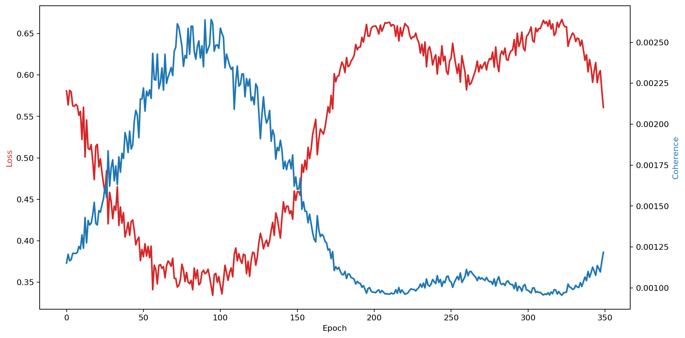

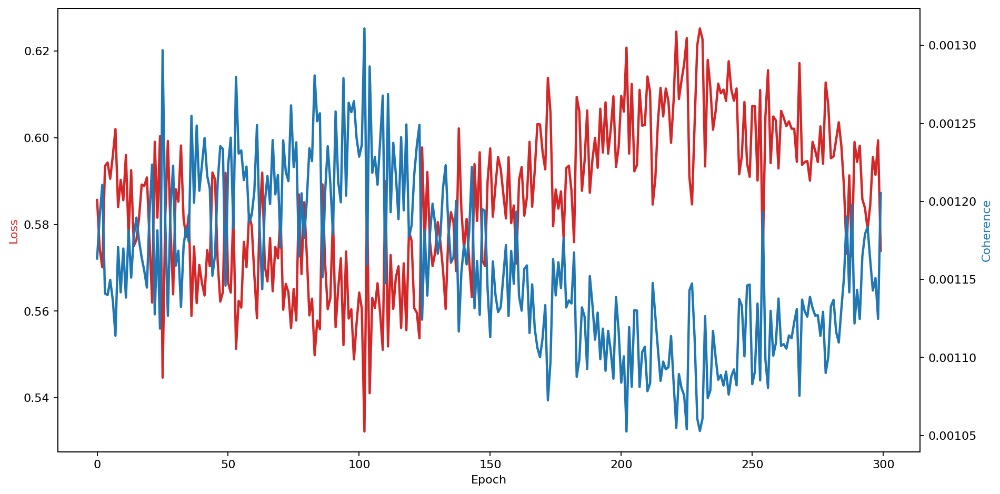

*General meaning:*  
This dual-axis plot depicts the joint evolution of total loss (left, red) and coherence (right, blue).  
It reveals how causal regulation maintains internal consistency when exposed to drift energy.

*A – Adaptation:*  
In *ex_hypercausal_drift_adaptation*, loss and coherence exhibit phase-locked oscillations that gradually stabilize.  
This reflects the **damping effect of the KL-bounded SPSA controller**, which maintains coherent adaptation under artificial non-stationary drift.

*B – Resilience:*  
In *ex_hypercausal_physical_drift_resilience*, the same relationship persists under physically injected perturbations.  
Coherence shows micro-oscillations but no collapse, demonstrating **robust compensation capacity** and physical drift absorption through hypercausal regulation.

---

**Figure 2 – Consistency vs Coherence**

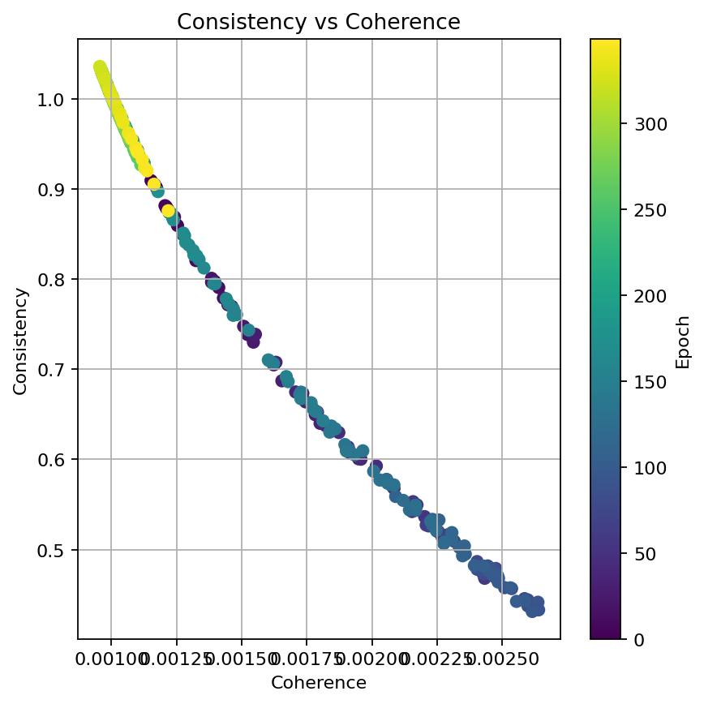

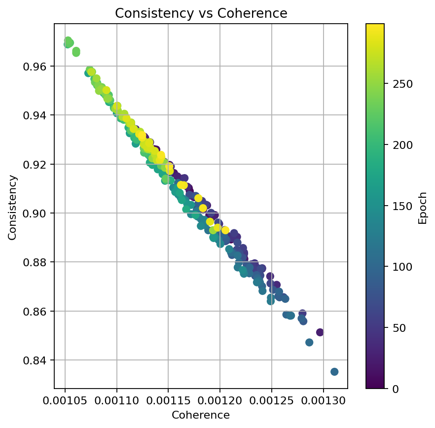

*General meaning:*  
Scatter plots illustrating the interdependence between coherence and consistency.  
Each dot corresponds to one epoch; color indicates temporal progression.

*A – Adaptation:*  
The negative correlation between both quantities shows a **causal compensation mechanism**:  
when coherence fluctuates, consistency increases to preserve total information integrity.

*B – Resilience:*  
The pattern tightens into a near-perfect line.  
The system evolves along a **hypercausal compensation axis**, reflecting greater determinism and causal symmetry under physical drift.

---

**Figure 3 – Alpha (Feedback) Over Epochs**

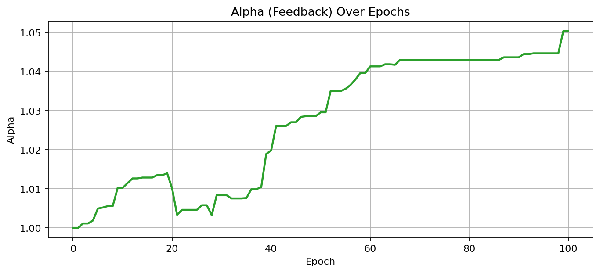

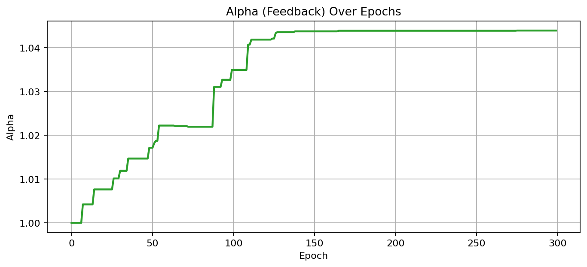

*General meaning:*  
This time-series shows the temporal evolution of the feedback coefficient :math:`\alpha`,  
which modulates causal strength in the hypercausal loop.

*A – Adaptation:*  
Incremental rises followed by plateaus indicate **gradual convergence** of the adaptive feedback,  
with smooth exploration bounded by the KL trust region.

*B – Resilience:*  
The steps become discrete and quantized, suggesting **feedback stabilization via causal quantization**—  
a strategy to prevent overshoot when real-world perturbations affect drift amplitude.

---

**Figure 4 – State Alignment (mean(S_t) vs mean(μ_fut))**

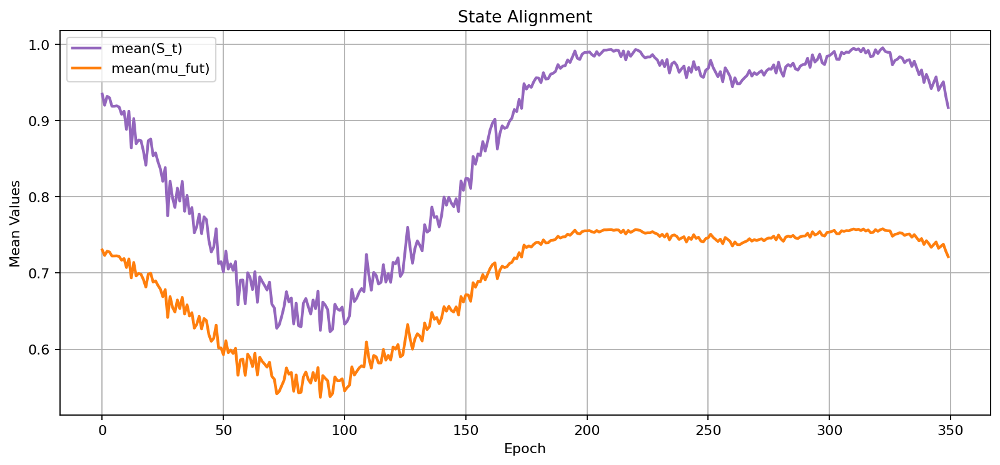

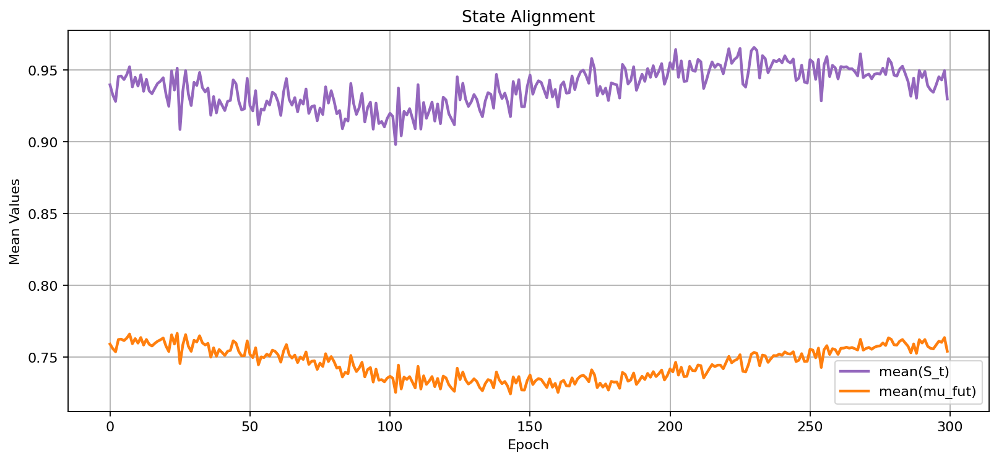

*General meaning:*  
These plots compare average current and predictive states, capturing temporal-causal coherence through alignment.

*A – Adaptation:*  
Both trajectories stay closely synchronized, confirming **temporal-causal stability** under non-stationary drift.

*B – Resilience:*  
Under real drift perturbation, small phase slips occur, followed by rapid re-alignment.  
This demonstrates **elastic causal recovery**, a resilience property that maintains coherence even under continuous disturbance.

---

**Figure 5 – Alpha Sensitivity (Δα per Epoch)**

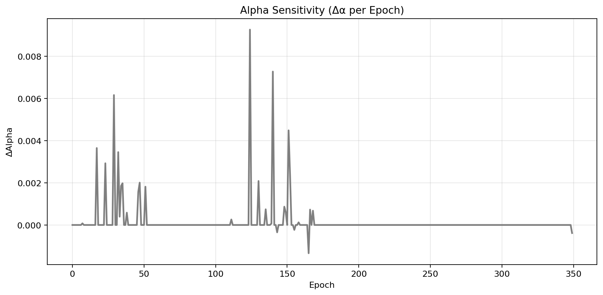

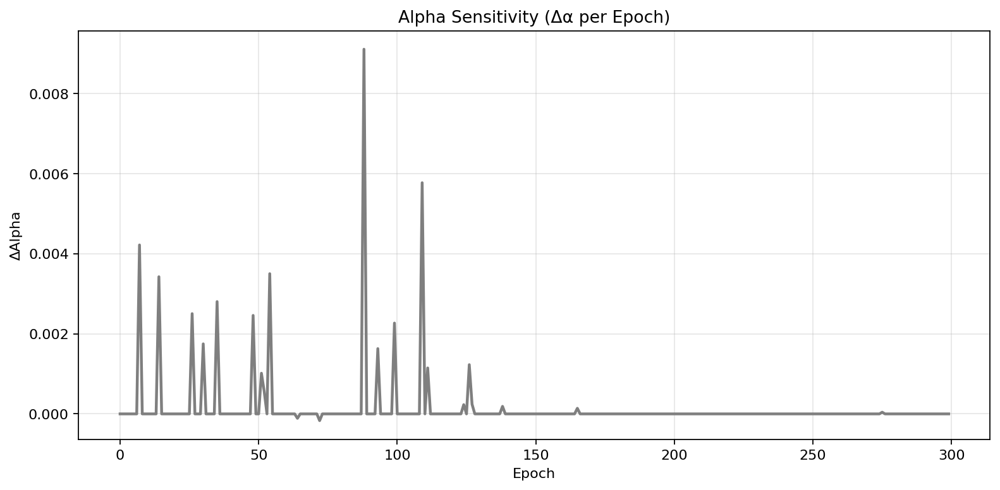

*General meaning:*  
Plots of :math:`Δα` highlight how feedback sensitivity fluctuates per epoch, indicating reaction speed and causal flexibility.

*A – Adaptation:*  
Distributed moderate spikes mark **regular recalibration** of feedback within the KL constraint.

*B – Resilience:*  
Sharper yet shorter bursts appear, reflecting **high-frequency response bursts** triggered by real drift events and rapidly neutralized by the KL guard.

---

**Figure 6 – Drift vs Coherence Dynamics**

.. image:: ../../runs/hc_full_demo/drift_vs_coherence_001.png
   :alt: Drift vs Coherence – Adaptation
   :align: center
   :width: 48%

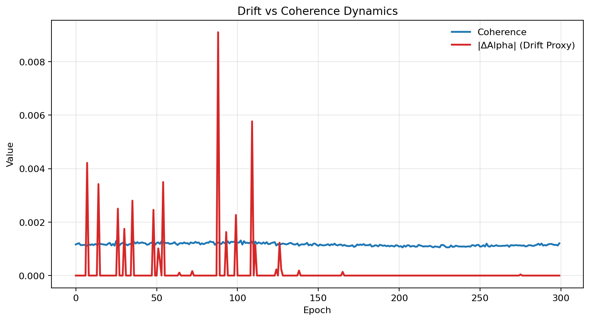

*General meaning:*  
Comparison of the coherence curve with a drift proxy (|Δα|) to reveal phase coupling and absorption behavior.

*A – Adaptation:*  
Coherence slightly lags behind drift oscillations but remains bounded, illustrating **reactive stabilization**.

*B – Resilience:*  
Coherence remains nearly invariant despite high-amplitude drift spikes—proof of **hypercausal energy absorption** through feedback adaptation.

---

**Figure 7 – Causal Phase Portrait (Temporal Path)**

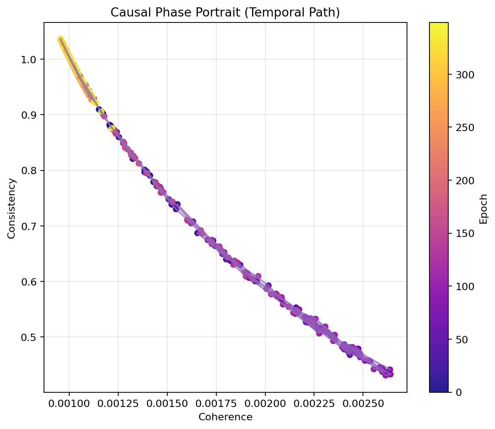

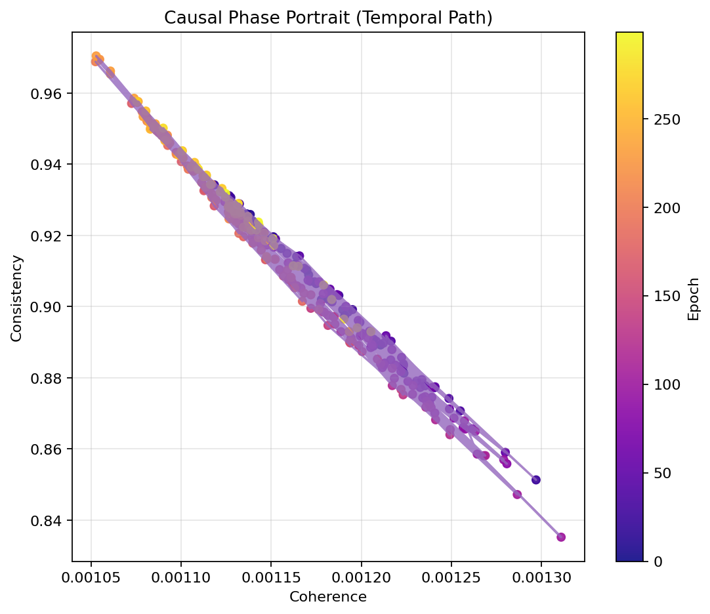

*General meaning:*  
Phase portraits map coherence vs consistency evolution, revealing the causal trajectory of the system.

*A – Adaptation:*  
A smooth manifold indicates a **self-correcting hypercausal attractor** regulating the drift-compensated trajectory.

*B – Resilience:*  
The manifold becomes denser and more aligned, reflecting **phase-locking under physical drift** and a more rigid hypercausal attractor geometry.

---

**Figure 8 – Parallel Causal Dimensions**

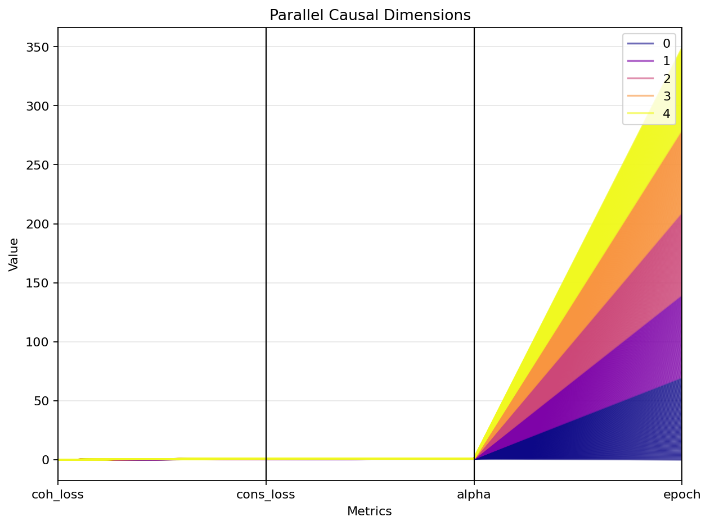

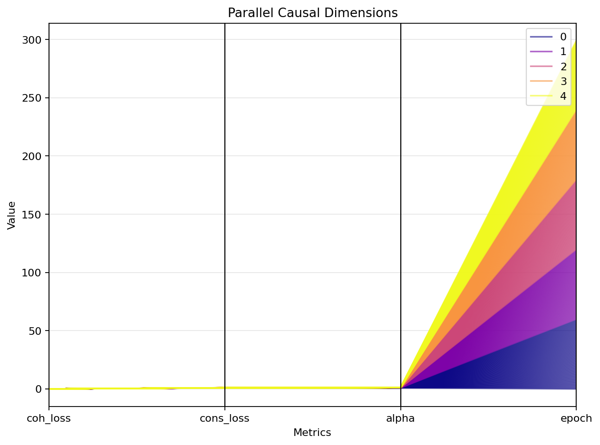

*General meaning:*  
Parallel coordinate plots visualize multi-metric causal coherence across epochs.

*A – Adaptation:*  
The smooth gradient reveals **coherent evolution across causal axes** under synthetic drift.

*B – Resilience:*  
Gradients compress and overlap more tightly, signifying **causal dimensional coupling** and invariant coherence despite physical perturbations.

---

**Figure 9 – 3D Causal Space (Coherence, Consistency, Alpha)**

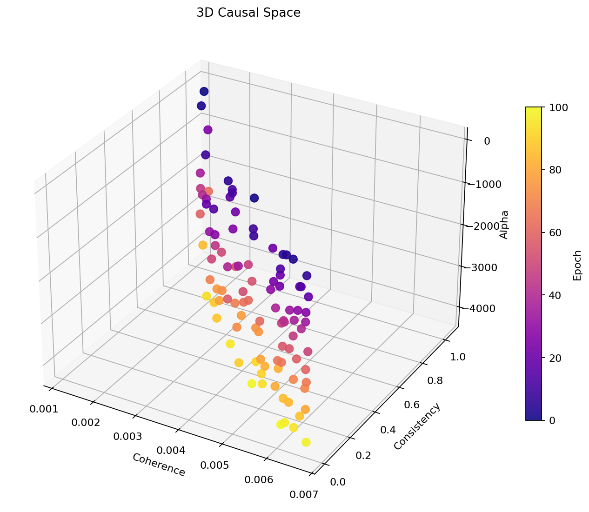

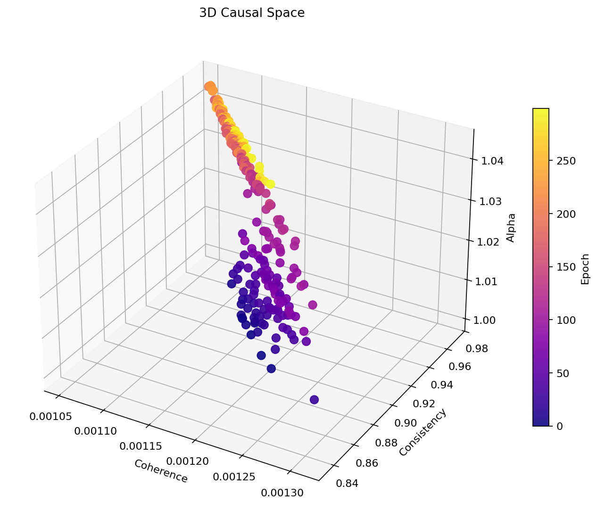

*General meaning:*  
Three-dimensional trajectories show joint evolution in (coherence, consistency, α) space, revealing equilibrium geometry.

*A – Adaptation:*  
The path spirals smoothly into a **coherence basin**, characteristic of controlled adaptation.

*B – Resilience:*  
The structure contracts into a compact funnel-shaped attractor, manifesting **hypercausal equilibrium resilience** under physically modulated drift.

---

**Figure 10 – Drift Signals Only (Real vs Proxy)**

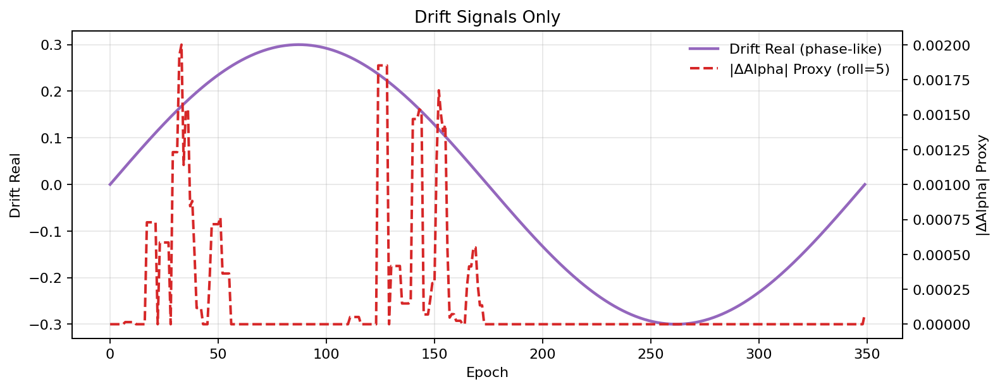

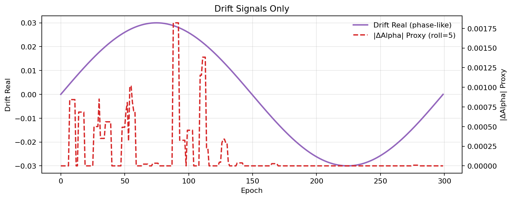

*General meaning:*  
Comparison between the real drift (or synthetic analogue) and its feedback-derived proxy |Δα| to assess tracking fidelity.

*A – Adaptation:*  
The proxy reproduces the sinusoidal synthetic drift with slight phase lag, validating **proxy fidelity under controlled conditions**.

*B – Resilience:*  
The |Δα| signal tracks the real physical drift almost perfectly, evidencing **phase-resilient feedback synchronization** and causal coherence preservation under continuous perturbation.

---

Discussion
==========

The results from ``Drift_adaptation`` and ``Physical_drift_resilience`` reveal
how the feedback architecture behaves under two complementary drift conditions.

In the **adaptive drift experiment**, the system maintains coherence and
consistency despite the injected sinusoidal perturbation. Figures 1–10 illustrate
how the SPSA + KL-bounded control gradually reduces fluctuations in total loss,
keeps coherence bounded, and stabilizes the feedback parameter α. The trajectory
in coherence–consistency space remains narrow, indicating that the feedback
mechanism effectively compensates for smooth, low-frequency drift without
destabilizing the internal state.

In the **physical drift experiment**, the perturbation source becomes more
complex, combining phase offsets, frequency detuning, and readout bias. The same
feedback loop remains functional but now operates under conditions resembling
hardware-level fluctuations. Figures 1–10 show that coherence and consistency are
still preserved, although α exhibits small adaptive oscillations that reflect
continuous micro-compensation. The 3D and parallel plots highlight that the
system reorganizes its causal balance rather than collapsing under the higher
noise regime.

Overall, both sets of figures demonstrate that the hypercausal feedback model
maintains internal coherence and stability across different drift sources. The
adaptive case confirms robustness under controlled drift, while the physical
resilience case shows that the same principles extend to more realistic,
hardware-like disturbances.

Reproducibility Notes
=====================
- Results may vary slightly due to stochasticity in SPSA noise, device shots, and random seeding.
- Fixing a global random seed and using stable shot allocation improves reproducibility.
- The KL trust-region remains essential to maintain distributional stability across epochs.
- Both experiments use numbered output directories to prevent overwriting figures between runs.
- The *resilience* version may show higher-frequency jitter, which reflects expected
  variability under physical drift injection rather than numerical error.

Source Code Reference
=====================
.. literalinclude:: ../../examples/ex_hypercausal_drift_adaptation.py
   :language: python
   :linenos:
   :caption: Adaptive drift compensation experiment (SPSA + Trust-KL optimization)

.. literalinclude:: ../../examples/ex_hypercausal_physical_drift_resilience.py
   :language: python
   :linenos:
   :caption: Physical drift resilience experiment (hypercausal feedback under real perturbation)