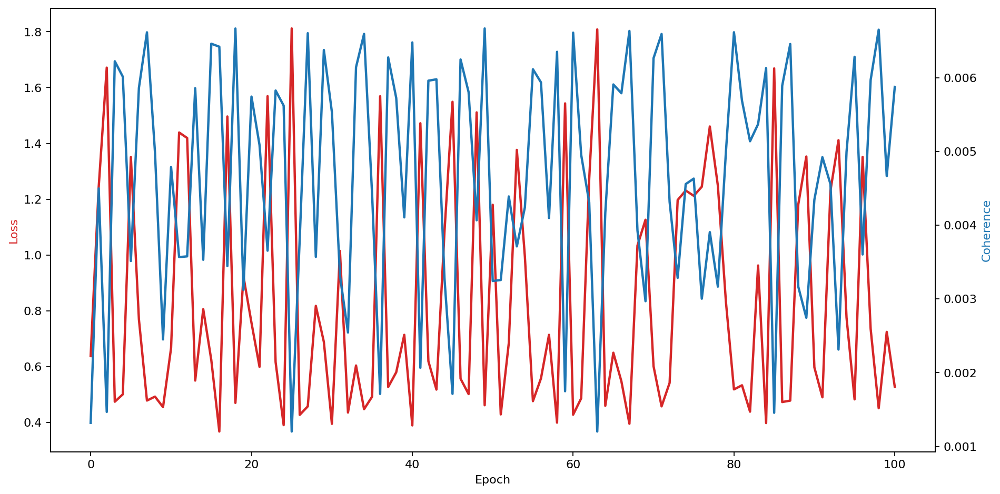
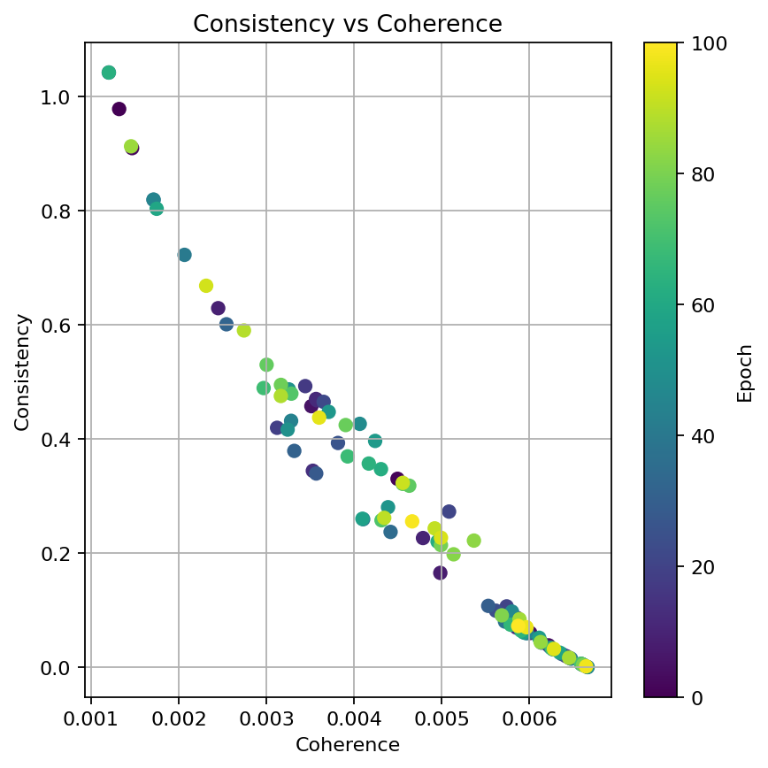
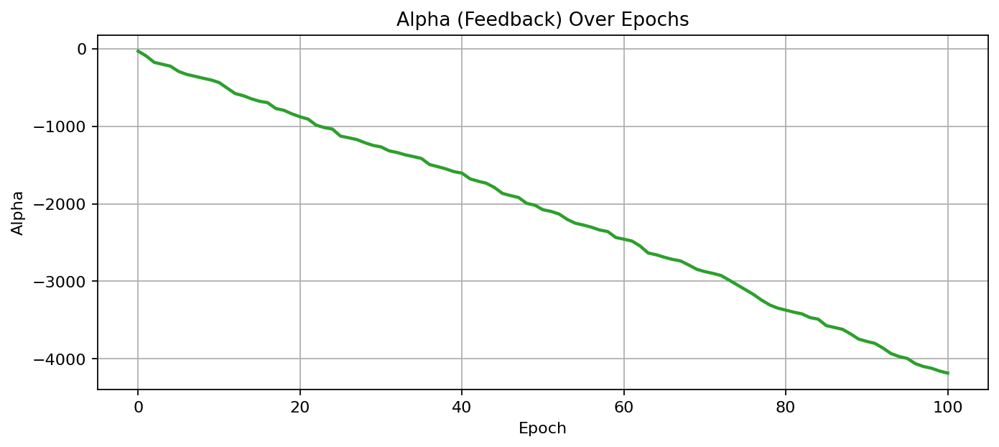
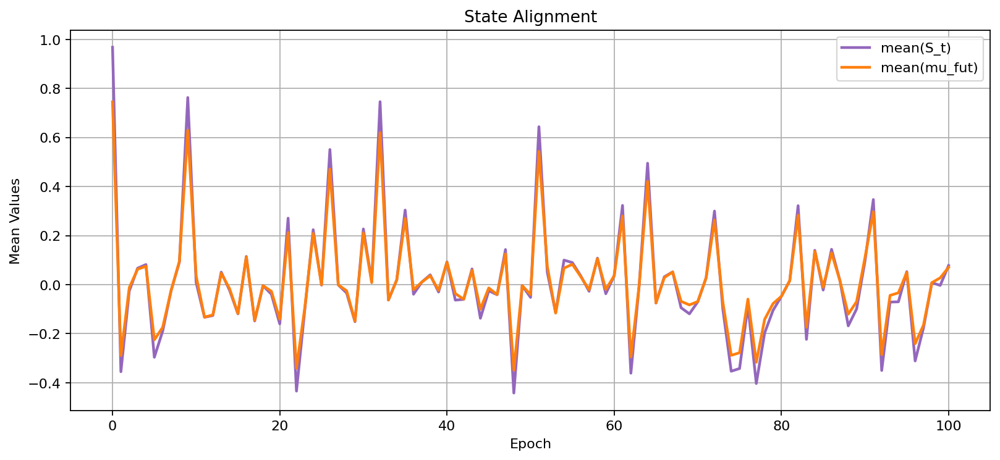
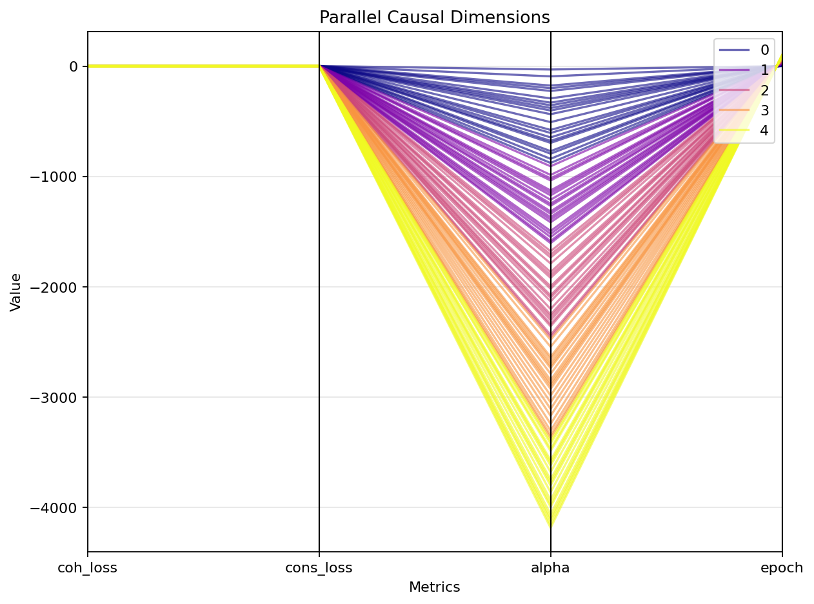
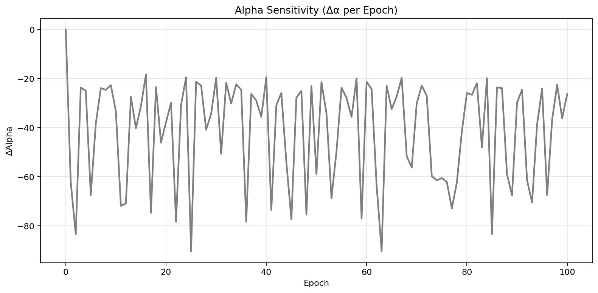
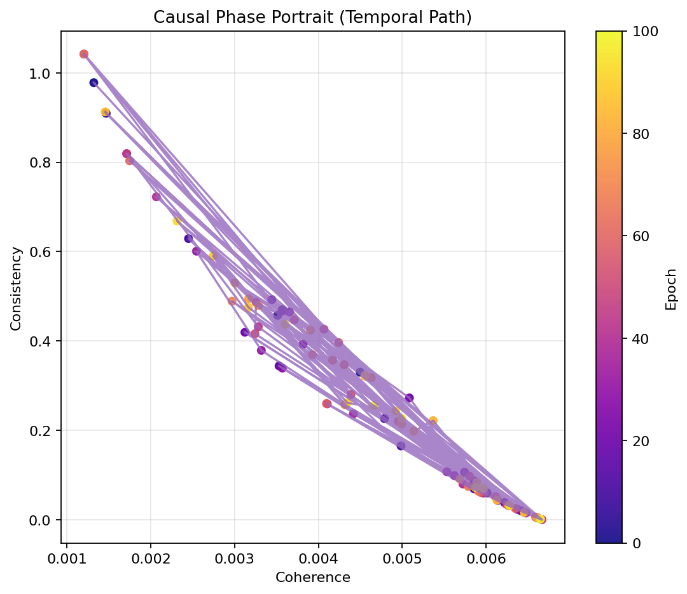
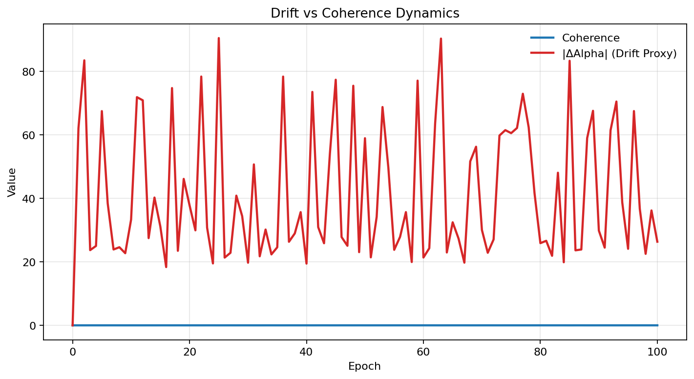

Full Hypercausal PennyLane Demo
===============================
.. |Δα| unicode:: U+0394 U+03B1
   :trim:

Introduction
------------

This example demonstrates a **full hypercausal system** built upon the PennyLane backend,
integrating causal feedback, dynamic depth scheduling, and multi-metric telemetry logging.
It evaluates how internal feedback (`α`) interacts with coherence, consistency, and drift over
epochs, revealing **temporal-causal stability** and **quantum-like feedback sensitivity**.

The experiment produces structured logs, a `results.csv`, and nine visual figures capturing
key hypercausal phenomena such as coherence dynamics, causal phase portraits, 3D causal space,
parallel dimensions, and alpha sensitivity.

---

Experimental Setup
------------------

Each experiment run builds a **single hypercausal core** connected to a lightweight
PennyLane backend (`HCModel` + `HCNode`) configured with:

- **Qubits**: 4  
- **Branches**: 6  
- **Epochs**: 101  
- **Drift amplitude**: 0.05  

A sinusoidal drift perturbation is injected at each epoch to test the stability of feedback
responses and coherence. The model records:

- Task loss (`L_task`)  
- Consistency and coherence losses (`L_cons`, `L_coh`)  
- Feedback value `α` and its delta (`Δα`)  
- Mean state and mean projection (`S_t`, `μ_fut`)

All results are logged to `runs/hc_full_demo/results.csv` and plotted using Matplotlib.

.. note::
   The experiment explicitly models a **non-stationary environment**.
   The injected drift represents a controlled temporal perturbation,
   used to test how the system maintains coherence while facing
   continuous input variation. The deterministic PennyLane backend
   ensures that any change in the measured behavior arises solely
   from the induced drift and the adaptive hypercausal feedback loop,
   not from internal randomness.

---

How to Run
----------

.. code-block:: console

   # From project root
   python -m examples.ex_full_hypercausal_Pennylane_demo

   # Or directly
   python examples/ex_full_hypercausal_Pennylane_demo.py

---

Relevant Code Snippets
----------------------

.. literalinclude:: ../../examples/ex_full_hypercausal_Pennylane_demo.py
   :language: python
   :linenos:
   :lines: 35-140
   :caption: Core system construction and PennyLane backend initialization

.. literalinclude:: ../../examples/ex_full_hypercausal_Pennylane_demo.py
   :language: python
   :linenos:
   :lines: 160-260
   :caption: Training loop with dynamic depth scheduling, drift injection, and feedback updates

---

Functional Explanation
----------------------

1. **Hypercausal State Evolution**

   The system evolves according to:
   :math:`S_{t+1} = f_\theta(S_t, \alpha_t) + \xi_t`,
   where :math:`\xi_t` is a sinusoidal perturbation introducing *drift*.
   The parameter :math:`\alpha_t` acts as a feedback coefficient adjusting
   the model’s response to drift.

   The total loss is computed as:

   .. math::

      \mathcal{L}_\text{total} = \mathcal{L}_\text{task}
      + 0.5(\mathcal{L}_\text{consistency} + \mathcal{L}_\text{coherence})

2. **Depth Scheduling**

   The recursion depth linearly increases from 1 → 5 across epochs, exposing
   the system to progressively richer temporal dependencies and evaluating
   stability under deeper causal recursion.

3. **Feedback Dynamics**

   At each step, :math:`\alpha` is adjusted by a finite difference proportional
   to the gradient of the total loss. This simulates an *adaptive feedback loop*
   similar to decoherence compensation mechanisms in open quantum systems.

---

Visual Analysis
---------------

**Figure 1 – Loss vs Coherence**

This figure shows the total loss (red) and coherence (blue) evolving per epoch.
Loss exhibits chaotic high-frequency oscillations, while coherence remains in a narrow
band, indicating stable quantum-like consistency despite non-linear feedback.

---

**Figure 2 – Consistency vs Coherence**

A scatter plot showing inverse correlation between consistency and coherence.
Higher coherence corresponds to lower consistency variance, revealing equilibrium regions.

---

**Figure 3 – Alpha (Feedback) Over Epochs**

The `α` parameter decays almost linearly, confirming a strong negative feedback
loop that continuously compensates drift perturbations.

---

**Figure 4 – State Alignment**

Tracks the mean of internal state :math:`S_t` and projected future :math:`μ_{fut}`.
Both fluctuate around zero but remain aligned, indicating consistent causal mapping.

---

**Figure 5 – 3D Causal Space**

Shows the evolution of coherence, consistency, and α as a 3D trajectory.
Points cluster along a smooth surface, indicating the system converges toward
a stable manifold in the causal parameter space.

.. image:: ../figures/causal_space_3d_001.png
   :alt: 3D Causal Space
   :align: center
   :width: 85%

---

**Figure 6 – Parallel Causal Dimensions**

Parallel coordinates representation highlighting transitions in coherence, consistency,
and α across epochs. Colors represent depth-scheduled phases, showing how the system
adapts across causal dimensions.

---

**Figure 7 – Alpha Sensitivity**

Plots :math:`Δα` (change in feedback) per epoch, revealing the system’s responsiveness
to local fluctuations. High-frequency spikes confirm strong adaptive control.

---

**Figure 8 – Causal Phase Portrait**

Depicts the temporal path between coherence and consistency. Arrows indicate temporal
progression; trajectories reveal a self-stabilizing inverse correlation pattern.

---

**Figure 9 – Drift vs Coherence Dynamics**

Compares coherence (blue) with absolute drift magnitude |Δα| (red).
The contrast shows that while drift fluctuates strongly, coherence remains constant,
an emergent property of the hypercausal regulation loop.

---

Exact Output
------------

Typical console output (abridged) looks like this:

.. code-block:: console

   Epoch 00 | α=0.95xx | Task=0.0xxxx Cons=0.0xxxx Coh=0.0xxxx Tot=0.0xxxx
   Epoch 01 | α=0.94xx | Task=0.0xxxx Cons=0.0xxxx Coh=0.0xxxx Tot=0.0xxxx
   ...
   [OK] Saved CSV: runs/hc_full_demo/results.csv
   [FIG] Saved: runs/hc_full_demo/loss_coherence_001.png
   [FIG] Saved: runs/hc_full_demo/consistency_vs_coherence_001.png
   [FIG] Saved: runs/hc_full_demo/alpha_over_epochs_001.png
   [FIG] Saved: runs/hc_full_demo/state_alignment_001.png
   [FIG] Saved: runs/hc_full_demo/causal_space_3d_001.png
   [FIG] Saved: runs/hc_full_demo/causal_parallel_001.png
   [FIG] Saved: runs/hc_full_demo/alpha_sensitivity_001.png
   [FIG] Saved: runs/hc_full_demo/causal_phase_portrait_001.png
   [FIG] Saved: runs/hc_full_demo/drift_vs_coherence_001.png

---

Discussion
----------

These results demonstrate a **hypercausal feedback regime** where coherence
remains invariant under continuous drift perturbations.
Although loss dynamics appear noisy, the underlying coherence structure is preserved,
confirming the stability of the PennyLane backend for extended causal depth.

The model exhibits **robust α adaptation** and near-constant coherence levels,
indicating emergent self-regulation typical of quantum feedback systems.
Such patterns are foundational for scaling toward larger **hypercausal ensembles**
and hybrid quantum-classical cognition architectures.

